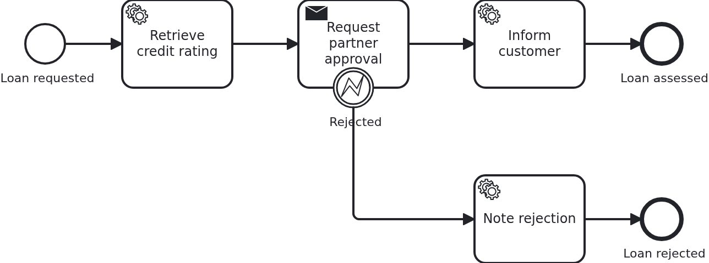

# Asynchronous tasks

[](./LICENSE)

Some work does not finish while the process asks for it. A partner is sent a request and
answers minutes or days later, through a callback nobody is waiting for. This blueprint
shows the task that stays open in between: what the application has to keep, and how it
later completes the task or cancels it.

## What this blueprint shows



The loan approval of the base blueprint, with a partner who has to approve the loan before
the customer is informed. Three things happen around that task:

- The task is delivered and VanillaBP calls `WorkflowTaskHandler#requestPartnerApproval`.
  The method sends the request and stores the task's `@TaskId` on the workflow aggregate.
  Returning from it does **not** complete the task, and that single parameter is what makes
  the difference: without it the very same method would complete the task by returning.
- The partner answers through the API, which calls `ProcessService#completeTask` with the
  stored id. The workflow leaves the task and the service task behind it runs.
- Or the partner refuses. The application calls `cancelTask` with the error code
  `partner-rejected`, so the workflow leaves through the error boundary event instead.

The same handler method is called a second time if the workflow takes the task away, this
time with `@TaskEvent CANCELED`, and it drops the stored id. A method without a
`@TaskEvent` parameter never learns about that and would keep an id nobody can answer any
more.

Two more things this blueprint carries:

- `Service#requestPartnerApproval` returns early if the aggregate already carries a task
  id. A remote BPMS may deliver the same task twice, and asking a partner twice may open
  two cases on their side. Idempotency is keyed on the state of the aggregate, never on a
  counter of invocations.
- A task id reaches the application from outside and may arrive twice, late, or for a task
  the workflow has taken away. `Service#openPartnerRequest` compares it with the one on the
  aggregate and refuses anything else, before the BPMS is involved.

Who guards which direction is worth knowing. Everything the application sends to the BPMS
goes through VanillaBP's transaction outbox, which keys operations for idempotency and
dispatches them at least once - completing a task twice is a logged no-op, and the same is
true for the answer of a partner arriving twice. The other direction is the application's
job: a BPMS may deliver the same task again, and
[the wiki says so plainly](https://github.com/vanillabp/adapter-platform-integration/wiki/Workflow-tasks#what-happens-when-my-handler-throws)
- key the decision on the state of the aggregate, which is what the early return above
does.

The difference to a user task is who answers, not how it works: the mechanics below are the
same, and `bpmn-user-task` shows them for a person instead of a system.

## Delta to the base blueprint

Compared to [`module-single`](https://github.com/vanillabp-blueprints/module-single-springboot):

|               File                |                                        What is different                                         |
|-----------------------------------|--------------------------------------------------------------------------------------------------|
| `loan_approval.bpmn`              | a send task the workflow waits at, an error boundary event on it, and a service task per way out |
| `WorkflowTaskHandler.java`        | the `@WorkflowTask` method of that task, taking `@TaskId` and `@TaskEvent`                       |
| `Workflow.java`                   | `completeTask` and `cancelTask` in addition to `startWorkflow`                                   |
| `Service.java`                    | both halves of the task: sending the request, and answering it when the partner replies          |
| `PartnerApprovalClient.java`      | new: the port to the surrounding system, so a test can replace it                                |
| `LocalPartnerApprovalClient.java` | new: a stand-in partner, so the blueprint runs without one                                       |
| `ApiController.java`              | the callback carrying the partner's answer                                                       |
| `Aggregate.java`                  | `partnerApprovalTaskId` and what the process wrote on the way out                                |
| `LoanApprovalIT.java`             | one test per way the task ends: still open, completed, canceled                                  |

The one line worth understanding is `camunda:delegateExpression` in the Camunda 7 model. A
task wired by `camunda:expression` is done as soon as the expression has been evaluated,
which is right for a service task and wrong here. Camunda 8 needs no counterpart: there a
job stays open until somebody completes it.

## Running it

Requires a JDK 21. Camunda 7 is embedded, so nothing else has to run:

```bash
mvn install verify
```

Running it on another BPMS is a Maven profile, not one line of Java changes:

```bash
mvn install verify -Pcamunda8
```

Camunda 8 is a remote engine, so a cluster has to run and be pointed at. Start one, then
add its address to `application/src/main/resources/application.yaml` and to
`loan-approval/src/test/resources/application.yaml`:

```yaml
vanillabp:
  adapters:
    camunda8:
      rest-address: http://localhost:8080
      # Nothing else is needed: this adapter keeps workflow modules apart by nothing at all
      # ('name-clash-avoidance: none') unless told otherwise, because a cluster started from
      # the stock image has multi-tenancy switched off and rejects a tenant per module. The
      # adapter warns about it while booting - with one workflow module the identifiers are
      # unique anyway. Set 'name-clash-avoidance: use-prefix' to have VanillaBP prefix them.
```

Start the application:

```bash
mvn -pl application spring-boot:run
```

Booting logs a warning per workflow module: both Camunda adapters start out with
`name-clash-avoidance: none`, so nothing keeps the identifiers of one workflow module apart
from those of another, and the adapter asks for a decision instead of picking one. One module
cannot collide with itself, so this blueprint leaves it at that. Answering the question is one
property, `vanillabp.adapters.<id>.accept-unscoped-identifiers: true`, and the modes a BPMS
offers are in
[the wiki](https://github.com/vanillabp/adapter-platform-integration/wiki/Workflow-modules#how-name-clashes-are-avoided).

Start a loan approval. This is the only URL you need:

```
http://localhost:8080/api/loan-approval/start?amount=5000
```

The process runs up to the partner and stops there. What it logs are the two URLs their
answer would arrive at, each one filled in and ready to be clicked:

```
Loan approval '0f7c…' started
Credit rating of loan approval '0f7c…' is 50
Partner was asked to approve loan approval '0f7c…' (5000 at a rating of 50)
Loan approval '0f7c…' waits for the partner. Their answer arrives at one of:
  Approved -> http://localhost:8080/api/loan-approval/0f7c…/partner-decision/1a2b…?approved=true
  Rejected -> http://localhost:8080/api/loan-approval/0f7c…/partner-decision/1a2b…?approved=false
```

Opening the first one completes the task, and the process continues to its end:

```
The partner approved loan approval '0f7c…'
The customer of loan approval '0f7c…' was informed
```

Opening the second one cancels it instead, and the workflow takes the error path:

```
The partner rejected loan approval '0f7c…'
The partner request of loan approval '0f7c…' was canceled
Loan approval '0f7c…' ended as rejected by the partner
```

The middle line is the cancellation arriving at the same handler method that sent the
request. Opening the same URL twice answers that this request is not open any more, which
the application decides on its own, without asking the BPMS.

While the application runs on Camunda 7, Camunda's own web applications are served at

```
http://localhost:8080/camunda
```

Log in with `demo` / `demo`. Cockpit shows the instance standing at the task that waits for
the partner, which is the view the logged URLs cannot give. The user comes from
`application/src/main/camunda7/resources/camunda7-webapps.yaml` and exists so that the
blueprint can be operated without setting one up; an application with an identity provider
of its own leaves that section out.

The Camunda 8 profile ships neither the dependency nor that file. Its tooling is part of
the cluster, and the file names a Camunda 7 adapter id, which VanillaBP would rightly
refuse to start with.

## How it works

|                                          File                                          |                                                  Role                                                   |
|----------------------------------------------------------------------------------------|---------------------------------------------------------------------------------------------------------|
| `loan-approval/src/main/resources/loan-approval/processes/camunda7/loan_approval.bpmn` | the process: a send task that stays open, an error boundary event on it, and a service task per way out |
| `.../loanapproval/WorkflowTaskHandler.java`                                            | the `@WorkflowTask` method of that task: `@TaskId`, `@TaskEvent`, and no work of its own                |
| `.../loanapproval/Service.java`                                                        | both halves of the task: sending the request once, answering it when the partner replies                |
| `.../loanapproval/Workflow.java`                                                       | `completeTask` and `cancelTask`, the only place `ProcessService` is used                                |
| `.../loanapproval/PartnerApprovalClient.java`                                          | the port to the surrounding system, so a test can put a simulator in its place                          |
| `.../loanapproval/ApiController.java`                                                  | the callback the partner's answer arrives at                                                            |
| `.../loanapproval/model/Aggregate.java`                                                | `partnerApprovalTaskId`, the handle to the open task, plus what the process wrote                       |
| `loan-approval/src/test/.../LoanApprovalIT.java`                                       | one test per way the task ends, waiting for the aggregate rather than asking the engine                 |

The order of events: the first service task fills in the credit rating, then the BPMS
delivers the waiting task and calls `WorkflowTaskHandler#requestPartnerApproval` with
`TaskEvent.CREATED`. The handler hands over to `Service`, which sends the request and stores
the task id on the aggregate - VanillaBP saves the aggregate after the call, like for any
other task. The workflow now waits, and no thread of the application waits with it.

Whenever the answer arrives, `ApiController` calls `Service#partnerDecided`, which writes
the result and tells `Workflow` what happened. `completeTask` and `cancelTask` run in a
transaction: the aggregate is saved along with the answer, and on a remote BPMS the
completion is sent only after that transaction committed. A rollback therefore leaves the
task open instead of completing a task whose result was undone.

The tests wait rather than assert immediately. A BPMS runs tasks in transactions of its own,
and a remote one delivers a task a moment after the workflow was started. Asserting right
away would pass on an embedded engine and fail on a remote one.

## Documentation

- [Completing and canceling asynchronous tasks](https://github.com/vanillabp/adapter-platform-integration/wiki/Workflow-tasks#completing-and-canceling-asynchronous-tasks): the rules those two calls follow
- [Parameters](https://github.com/vanillabp/adapter-platform-integration/wiki/Workflow-tasks#parameters): `@TaskId`, `@TaskEvent` and everything else a handler may ask for
- [What happens when my handler throws?](https://github.com/vanillabp/adapter-platform-integration/wiki/Workflow-tasks#what-happens-when-my-handler-throws): why sending the request twice has to be prevented by the aggregate
- [User tasks and asynchronous tasks](https://github.com/vanillabp/spi-for-java#user-tasks-and-asynchronous-tasks): the annotations used in `WorkflowTaskHandler.java`
- the wiki of the [BPMS adapter](https://github.com/vanillabp/adapter-platform-integration/wiki/BPMS-adapters) you use: how a task has to be modelled so that it can stay open

This blueprint is developed in the monorepo
[`blueprints`](https://github.com/vanillabp-blueprints/blueprints). This repository is a
read-only mirror, **issues and pull requests belong there.**

## Noteworthy & Contributors

[VanillaBP](https://www.github.com/vanillabp/spi-for-java) was developed by [Phactum](https://www.phactum.at) with the
intention of giving back to the community as it has benefited the community in the past.


## License

Copyright 2026 Phactum Softwareentwicklung GmbH

Licensed under the Apache License, Version 2.0
